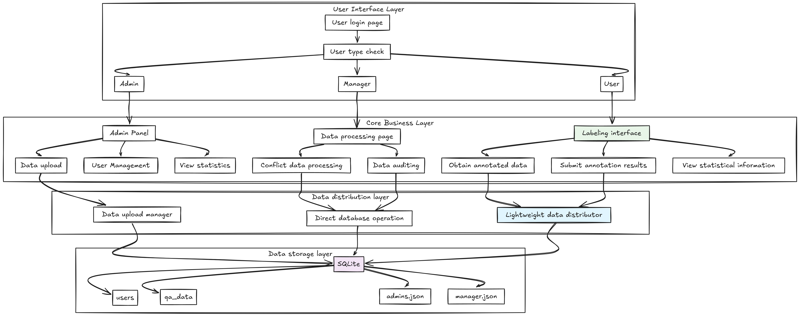
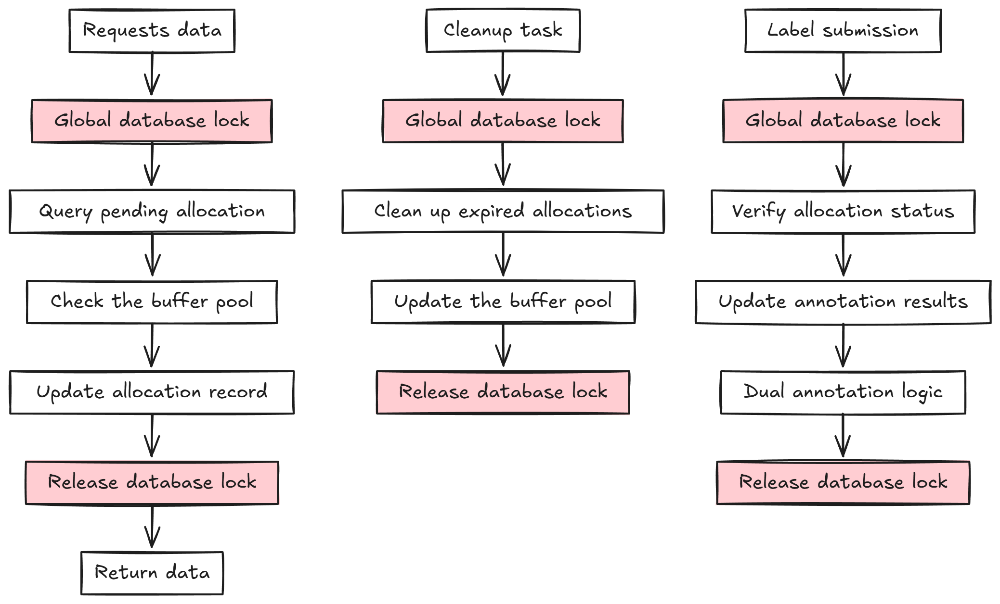

# 问答数据标注系统

一个完整的问答数据标注、管理和导出系统，支持双重标注、数据统计和多格式导出。

标注系统的整体架构图如下：



## 核心模块

### DataUploader - 数据上传
- **JSON文件上传**: 支持文件和文本上传
- **数据验证**: 格式验证和必需字段检查
- **批量导入**: 事务安全的批量插入
- **上传统计**: 详细的上传统计信息

### DataDistributor - 数据分发
- **智能分配**: 自动分配待标注数据
- **双重标注**: 支持第一次和第二次标注流程
- **缓冲池管理**: 防止数据冲突的分配机制
- **状态追踪**: 实时监控数据分配状态

该模块的核心流程如下：



不过这种设计存在许多潜在问题，因此在后续的开发版本中被弃用。典型问题包括：
1. **全局锁竞争严重**
   - 所有用户共享一个数据库锁
   - 高并发时性能急剧下降
   - 容易出现死锁和饥饿现象

2. **缓冲池管理复杂**
   - 全局缓冲池状态维护困难
   - 数据一致性难以保证
   - 过期数据清理效率低

3. **资源利用率低**
   - 锁粒度过大，并发性差
   - CPU和内存利用率不均

### DataExporter - 数据导出
- **多格式导出**: CSV、JSON、Excel
- **灵活筛选**: 状态、标注员、结果筛选
- **中文支持**: 完整UTF-8编码支持

### DataManager - 数据管理  
- **数据删除**: 单条/批量删除
- **数据清空**: 安全的全量清空
- **数据统计**: 详细的统计信息
- **数据备份**: 删除前自动备份

### UserManager - 用户管理
- **用户详情**: 完整的用户信息和统计
- **活跃度分析**: 标注频率和时间分布
- **一致性统计**: 标注质量和一致性评估
- **工作记录**: 最近标注历史追踪

## 快速开始

### 安装依赖
```bash
pip install flask openpyxl  # openpyxl为可选，用于Excel导出
```

### 数据上传
```python
from DataUploader import DataUploader

uploader = DataUploader('users.db')

# 从文本上传
json_data = '[{"问题": "测试问题", "答案": "测试答案"}]'
result = uploader.upload_from_text(json_data, 'user123')

# 从文件上传
result = uploader.upload_from_file(file_obj, 'user123')
```

### 数据分发
```python
from DataDistributor import DataDistributor

distributor = DataDistributor('users.db')

# 获取待标注数据
data = distributor.get_qa_data_for_annotation('user123')

# 保存标注结果
success = distributor.save_annotation(data_id, 'user123', 'good')

# 获取用户统计
stats = distributor.get_user_annotation_stats('user123')
```

### 用户管理
```python
from UserManager import UserManager

user_manager = UserManager('users.db')

# 获取用户详细信息
user_info = user_manager.get_user_detail_info(user_id=1)

# 获取用户基本信息
basic_info = user_manager.get_user_basic_by_id(user_id=1)
```

### 数据导出
```python
from DataExporter import DataExporter

exporter = DataExporter('users.db')

# 导出所有数据
response = exporter.export_data('csv')

# 筛选导出
filters = {'status': 'completed', 'result': 'good'}
response = exporter.export_data('xlsx', filters)
```

### 数据管理
```python
from DataManager import DataManager

manager = DataManager('users.db')

# 删除指定数据
result = manager.delete_qa_data_by_ids([1, 2, 3], 'batch')

# 获取统计信息
stats = manager.get_data_statistics()

# 备份数据
backup = manager.backup_data_before_delete()
```

## 主要功能

### 数据分发功能
- **智能分配**: 自动分配待标注数据，避免冲突
- **双重标注**: 完整的第一次和第二次标注流程
- **缓冲池机制**: 防止多用户同时标注同一数据
- **超时管理**: 自动清理过期的数据分配
- **一致性检查**: 自动判断两次标注结果一致性

### 用户管理功能
- **用户统计**: 标注数量、质量评估
- **活跃度监控**: 日均标注量和时间分布
- **一致性分析**: 标注一致性评估
- **在线状态**: 实时用户状态监控
- **工作历史**: 详细的标注记录追踪

### 数据上传功能
- **JSON格式**: 支持标准JSON数组格式
- **必需字段**: 问题、答案为必填项
- **支持字段**: 中英文问题答案、学科分类、线索信息等
- **文件上传**: 支持.json文件上传
- **批量处理**: 事务安全的批量数据插入

### 导出筛选选项
- **状态**: `all`, `pending`, `first_completed`, `completed`
- **标注员**: `all` 或具体用户名
- **一致性**: `all`, `agreed`, `conflicted`  
- **结果**: `good`, `bad`, `uncertain`, `high_quality`等

### 数据管理功能
- **安全删除**: 支持事务回滚
- **批量操作**: 高效的批量删除
- **数据备份**: JSON格式自动备份
- **统计分析**: 多维度数据统计

## 数据格式

### JSON上传格式
```json
[
  {
    "问题": "这是一个中文问题",
    "答案": "这是对应的中文答案",
    "问题（英语）": "This is an English question",
    "答案（英语）": "This is the corresponding English answer",
    "问题学科": "数学",
    "clue_urls": ["http://example.com"],
    "traces": ["推理步骤1", "推理步骤2"],
    "answer_clue": "答案线索",
    "answer_url": "http://answer.com",
    "check_info": {"quality": "high"},
    "dfsw": {"status": "verified"}
  }
]
```

### 数据库字段

| 字段 | 说明 |
|------|------|
| question_cn/en | 中英文问题 |
| answer_cn/en | 中英文答案 |
| subject | 学科分类 |
| first/second_annotator | 双重标注员 |
| annotation_result | 标注结果 |
| final_status | 最终状态 |

## 文件格式

- **CSV**: UTF-8编码，Excel兼容
- **JSON**: 美化输出，保持结构
- **Excel**: 样式优化，自动列宽

## 安全特性

- 删除前数据验证
- 事务支持防止数据丢失
- 自动备份机制
- 确认码保护（清空操作）

## 许可证

请查看 LICENSE 文件。